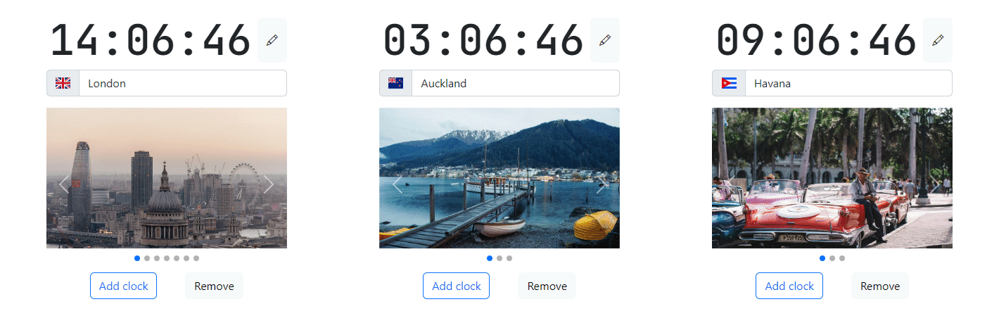

# React Time Difference




[Live demo](https://petukhov.cyou/react-time-difference/)
## Description
This application enables you to compare times in different timezones instantly. You can check a few places at once. Therefore, making it very easy to find the most suitable time for everybody.

This application enables users to add as many clocks as they want. When time is set for a specific timezone, the time in the rest of the time zones changes accordingly. It could be quite useful for arranging meetings, if your colleagues live in different places.

>The idea behind this project is to demonstrate that I can
>* create a single-page web application with React
>* perform unit testing of React components using Jest
>* bundle a JavaScript project with WebPack

## Get started
1. Install dependencies `npm install`
2. Build the project `npm run build`
3. Serve `npm install --global serve` `npm run start`

## Unit test coverage
```---------------------------|---------|----------|---------|---------|-------------------
File                       | % Stmts | % Branch | % Funcs | % Lines | Uncovered Line #s 
---------------------------|---------|----------|---------|---------|-------------------
All files                  |      84 |    88.28 |   78.48 |   86.05 |                   
 src                       |     100 |      100 |     100 |     100 |                   
  settings.js              |     100 |      100 |     100 |     100 |                   
 src/components            |   75.34 |    85.05 |   63.82 |   78.98 |                   
  autocomplete-dropdown.js |   96.77 |    89.47 |   88.88 |   96.66 | 76                
  carousel.js              |     100 |      100 |     100 |     100 |                   
  clock-collection.js      |   31.37 |    33.33 |   15.78 |   36.36 | 29-34,46-91,104   
  clock.js                 |     100 |       90 |     100 |     100 | 1
  time.js                  |     100 |    93.54 |     100 |     100 | 15,59
 src/helpers               |     100 |      100 |     100 |     100 | 
  base64-helper.js         |     100 |      100 |     100 |     100 | 
  geo-helper.js            |     100 |      100 |     100 |     100 | 
  image-cache-data.js      |     100 |      100 |     100 |     100 | 
  image-cache.js           |     100 |      100 |     100 |     100 | 
  pexels-helper.js         |     100 |      100 |     100 |     100 | 
  url-cache-helper.js      |     100 |      100 |     100 |     100 | 
 tests                     |     100 |      100 |     100 |     100 | 
  testData.js              |     100 |      100 |     100 |     100 | 
---------------------------|---------|----------|---------|---------|------------------
```